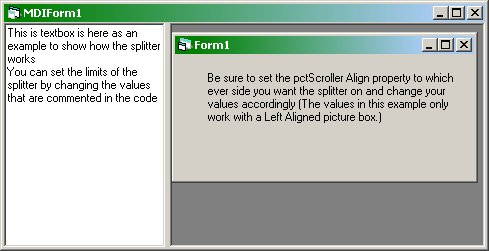



## A Simple Splitter

### Description

This will show you how to make a quick little splitter for an mdi form using only a picture box and an image control.You can set limits for the minimum and maximum widths. I also use a stopflicker routine for a smooth transition at the minimum and maximum widths. This is not one of the best ways of doing this but it is quick and it does work
 
### More Info
 

             |
---                |---
**Submitted On**   |2003-11-09 09:55:24
**By**             |[Robert Gainor](https://github.com/Planet-Source-Code/PSCIndex/blob/master/ByAuthor/robert-gainor.md)
**Level**          |Intermediate
**User Rating**    |4.6 (32 globes from 7 users)
**Compatibility**  |VB 6\.0
**Category**       |[Custom Controls/ Forms/  Menus](https://github.com/Planet-Source-Code/PSCIndex/blob/master/ByCategory/custom-controls-forms-menus__1-4.md)
**World**          |[Visual Basic](https://github.com/Planet-Source-Code/PSCIndex/blob/master/ByWorld/visual-basic.md)
**Archive File**   |[A\_Simple\_S1669841192003\.zip](https://github.com/Planet-Source-Code/robert-gainor-a-simple-splitter__1-49774/archive/master.zip)

### API Declarations

see project file

